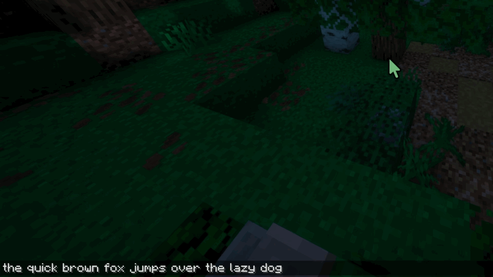

# CMD + Delete

In Minecraft on macOS, pressing `option` + `backspace` deletes a single character, and pressing `command` + `backspace` deletes a word. **This is completely inconsistent with the native OS**, so I fixed it...

This mod also functions as a fully configurable text editing/navigation shortcut framework for Minecraft with custom mappings JSONs and sharecodes, in-game switching, and more!

## Some Context

1. If you use this mod on Windows or Linux, and you don't use custom mappings, nothing will change from vanilla Minecraft.
2. If you have any problems with this mod, **please report them as Issues on GitHub**. This mod is Open Source and Pull Requests are very much welcome! :)
3. For technical information about custom mappings and how the mod works, you should go to the [CMD + Delete documentation](https://omegabird113.github.io/CMD_Delete/). 

> [!Note]
>
> CMD + Delete is a **Fabric mod** which also supports Quilt for Minecraft 1.14.4 to the latest version.
> 
> It also supports Forge 1.20.1 and NeoForge 1.21.1, but **only with [Sinytra Connector](https://modrinth.com/mod/connector)**.

## Builtin Mappings' Shortcuts

By default, CMD + Delete will detect if you're using macOS, and if you are it'll set you to those shortcuts, otherwise it will set you to use Windows/Linux shortcuts.

| Action                  | macOS                    | Windows / Linux           |
|-------------------------|--------------------------|---------------------------|
| Delete previous word    | `option` + `backspace`   | `ctrl` + `backspace`      |
| Delete next word        | `option` + `delete`      | `ctrl` + `delete`         |
| Delete to start of line | `cmd` + `backspace`      | N/A                       |
| Delete to end of line   | `cmd` + `delete`         | N/A                       |
| Move to previous word   | `option` + `←`           | `ctrl` + `←`              |
| Move to next word       | `option` + `→`           | `ctrl` + `→`              |
| Move to start of line   | `cmd` + `←`              | `home`                    |
| Move to end of line     | `cmd` + `→`              | `end`                     |
| Move to start of text   | `cmd` + `↑`              | `ctrl` + `home`           |
| Move to end of text     | `cmd` + `↓`              | `ctrl` + `end`            |
| Select to previous word | `option` + `shift` + `←` | `ctrl` + `shift` + `←`    |
| Select to next word     | `option` + `shift` + `→` | `ctrl` + `shift` + `→`    |
| Select to start of line | `cmd` + `shift` + `←`    | `shift` + `home`          |
| Select to end of line   | `cmd` + `shift` + `→`    | `shift` + `end`           |
| Select to start of text | `cmd` + `shift` + `↑`    | `ctrl` + `shift` + `home` |
| Select to end of text   | `cmd` + `shift` + `↓`    | `ctrl` + `shift` + `end`  |
| Select up one line      | `shift` + `↑`            | `shift` + `↑`             |
| Select down one line    | `shift` + `↓`            | `shift` + `↓`             |

## Other Builtin Mappings

CMD + Delete also now provides these other builtin mappings:
- `builtin:emacs_windows_linux` the standard Windows/Linux shortcuts for text navigation in Emacs to the best replication I can make (they're not perfect).
- `builtin:emacs_mac` the standard macOS Cocoa shortcuts for text navigation in Emacs to the best replication I can make (they're not perfect).
- `builtin:readline` the standard shortcuts for text navigation in GNU Readline to the best replication I can make (they're not perfect).

## Licensing

- The CMD + Delete mod itself is licensed under the [Apache 2.0 license](https://www.apache.org/licenses/LICENSE-2.0.html).
- The CMD + Delete wiki/documentation is licensed under the [CC BY 4.0 license](https://creativecommons.org/licenses/by/4.0/legalcode.en).
- All builtin mappings JSON files are available under either the [Apache 2.0 license](https://www.apache.org/licenses/LICENSE-2.0.html) or the [CC BY 4.0 license](https://creativecommons.org/licenses/by/4.0/legalcode.en) (You may chose to comply with either license).
- You may include CMD + Delete in any CurseForge and/or Modrinth modpack.
